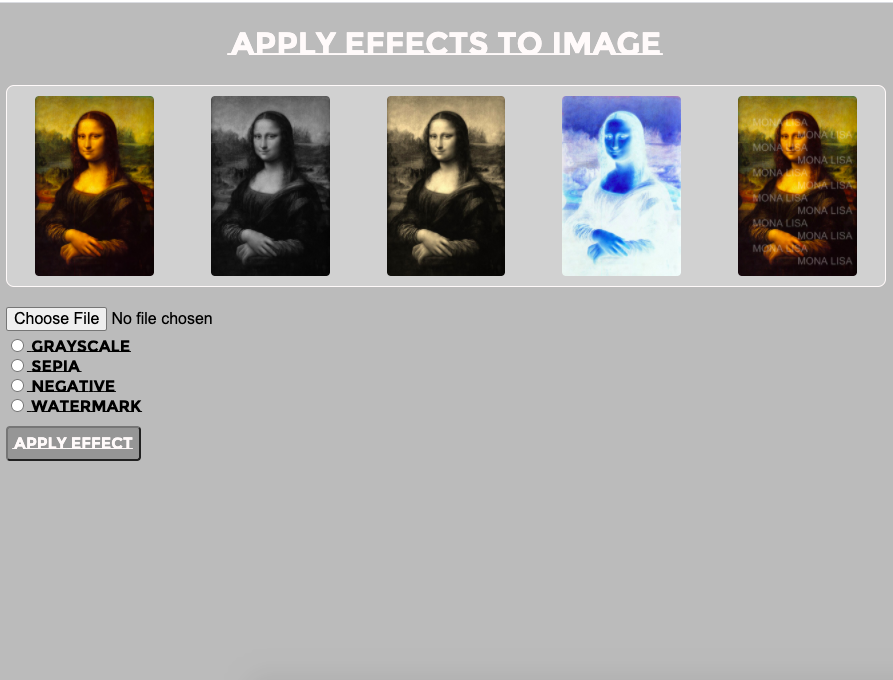

# Image Effects 
...ongoing project...\
Apply effects to uploaded image.\
Image effect codes used from [GeeksForGeeks](https://www.geeksforgeeks.org/image-processing-java-set-1-read-write/?ref=lbp)

## Client

## Grayscale

## Sepia

## Negative

## Watermark

